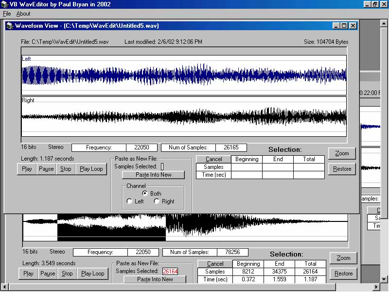



## TrueWavEditor \(Updated\)

### Description

I've seen hundreds of requests for a PURE VB Proggie, which can Copy & Play Audio Portions, Zoom in On, and Save Windows Wav files. So here it is: The TrueWavEditor will load ".wav" files of your choice, after which you have Selection, Zoom, Loop, and PASTE AS NEW FILE Options! This is Based on My TrueWavAnayzer Project also listed here on PSC. The Proggie will name your "selection" as 'Untitled#.wav' in the App.Path, then Opens it as a new Instance of WavForm. Everything except 'Play', functions without a soundcard (since it's all binary reads and writes). These Projects took quite a bit of my time to research & write (mostly with translating Various math Filters into Code, and figuring out the RIFF Audio File Format Structure which includes Video formats as well). If I get a good response from this, I may start on a complete Wave Studio, in Pure VB (if Possible, cause this binary stuff just don't perform very quickly in vb), as you'll see if you download. Added support for all the common wave format combinations. I Fixed the 16 bit Stereo Paste Bug...
 
### More Info
 

             |
---                |---
**Submitted On**   |2002-02-22 16:01:50
**By**             |[Zaphod](https://github.com/Planet-Source-Code/PSCIndex/blob/master/ByAuthor/zaphod.md)
**Level**          |Advanced
**User Rating**    |5.0 (174 globes from 35 users)
**Compatibility**  |VB 5\.0, VB 6\.0
**Category**       |[Complete Applications](https://github.com/Planet-Source-Code/PSCIndex/blob/master/ByCategory/complete-applications__1-27.md)
**World**          |[Visual Basic](https://github.com/Planet-Source-Code/PSCIndex/blob/master/ByWorld/visual-basic.md)
**Archive File**   |[TrueWavEdi568792222002\.zip](https://github.com/Planet-Source-Code/zaphod-truewaveditor-updated__1-31558/archive/master.zip)

